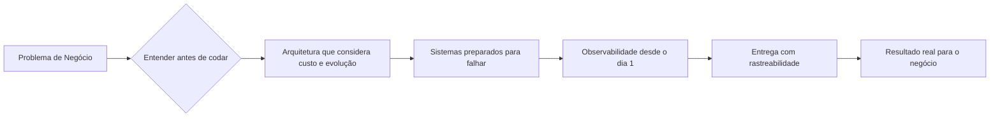

<div align="center">


[](https://git.io/typing-svg)

<a href="https://www.linkedin.com/in/gusta-nascimento/"></a>
<a href="mailto:caous.g@gmail.com"></a>
<a href="https://www.instagram.com/gusta.nascimento/"></a>


</div>

---

## 🧑‍🚀 Sobre mim

```csharp
var gustavo = new SoftwareEngineer
{
    Nome        = "Gustavo Nascimento",
    Papel       = ["Senior Software Engineer", "Tech Lead", "Founder"],
    Foco        = ".NET | Microsserviços | Cloud | Sistemas Distribuídos",
    Setor       = "Financeiro (Itaú, BMG, XP Inc.) + Empreendedorismo",
    Empresa     = "InnovaSfera",
    Princípio   = "Tecnologia existe para resolver problemas reais",
    Aprendendo  = "Sempre. Tolo é aquele que acha que sabe de tudo."
};
```

Minha trajetória começou em **infraestrutura, redes e segurança**, evoluiu para o **desenvolvimento de sistemas corporativos** e chegou a **projetos de alta criticidade no setor financeiro** — processamento bancário, crédito consignado, sistemas fiscais e regulatórios.

Hoje atuo como **engenheiro sênior e referência técnica**, com foco em arquitetura de software, modernização de aplicações, mensageria, observabilidade e liderança de times. Também sou **fundador da InnovaSfera**, onde entrego soluções ponta a ponta — do levantamento de requisitos à produção.

> 💡 *"O que trouxe uma pessoa até o nível atual pode não ser suficiente para levá-la ao próximo."*

---

## 💼 Experiência & Resultados

<details>
<summary><b>🏦 XP Inc. — Senior Software Engineer</b> <i>(sistemas fiscais e Imposto de Renda)</i></summary>
<br>

Modernização da esteira de processamento fiscal das marcas do grupo XP:

- Criação de **microsserviço de validação de dados fiscais** cruzando dados da Receita Federal com bases internas — inconsistências detectadas **antes** de chegarem ao cliente;
- 📉 Resultado: chamados operacionais reduzidos de **~789 para ~145**;
- Alto volume de dados, processamento assíncrono com **Kafka**, **Redis**, idempotência, DLQ, retry, circuit breaker;
- Escalabilidade com **Kubernetes + HPA**, ETL com **Python**, **AWS S3/SQS**;
- Observabilidade completa: logs estruturados, métricas, traces distribuídos.

</details>

<details>
<summary><b>🏦 Banco BMG — Desenvolvedor Sênior / Referência Técnica</b></summary>
<br>

- Participação no **Desenrola Brasil** e na **modernização da plataforma de crédito consignado**;
- Estratégia de **feature flags + fallback entre fornecedores** — troca de fornecedor sem novo deploy, mais resiliência e menos risco operacional;
- Decisões arquiteturais, code review, mentoria de desenvolvedores e ponte entre técnica e negócio.

</details>

<details>
<summary><b>🏦 Itaú (via Indra) — Desenvolvedor</b></summary>
<br>

- Sustentação e evolução de sistemas críticos de **processamento bancário**: cheques, cartões, compensação;
- Sistemas legados de alta criticidade, grandes volumes de dados e ambientes com alta exigência de segurança e disponibilidade.

</details>

<details>
<summary><b>🚛 Action Cargo — Desenvolvedor</b> <i>(transformação digital)</i></summary>
<br>

- Digitalização de processos baseados em papel e planilhas;
- Intranet, extranet, módulos de RH e financeiro, faturamento, boletos, documentos fiscais e acompanhamento logístico.

</details>

<details>
<summary><b>🔧 Intelligence for Us — Infraestrutura & Segurança</b> <i>(início de carreira)</i></summary>
<br>

- Redes, cabeamento estruturado, firewall, servidores e suporte;
- Base que me deu visão completa de como software, rede e segurança se conectam no ambiente corporativo.

</details>

---

## 🚀 Projetos em destaque

| Projeto | Descrição | Stack |
|---|---|---|
| 🧾 **Esteira Fiscal / IR** | Validação de dados fiscais em alto volume, -80% de chamados | .NET, Kafka, Redis, K8s, Python, AWS |
| 💳 **Crédito Consignado** | Modernização com feature flags e fallback entre fornecedores | .NET, APIs, Resiliência |
| 🤝 **Desenrola Brasil** | Programa federal de renegociação — contexto bancário regulatório | .NET, Integrações |
| 🎓 **Instituto Barros** | Plataforma web completa: alunos, funcionários e operações | React, .NET, Azure, Clean Arch |
| 🔧 **Gestão de Oficinas** | OS, peças, contratos, faturamento | React, TS, ASP.NET Core, DDD |
| 📦 **API de Pedidos** | Importação e processamento com rastreabilidade total | .NET 8, PostgreSQL, OpenTelemetry, Dynatrace |
| 💬 **Automação WhatsApp** | Atendimento orientado a eventos | Evolution API, n8n, Redis, PostgreSQL |
| 🤖 **Esteira de Dev com Agentes de IA** | Pipeline onde nenhum código existe sem critério de aceite, e nenhum critério é entregue sem teste | Claude Code, MCP, Markdown PBIs, YAML Registry |

---

## 🛠️ Stack principal

<div align="center">


</div>

<details>
<summary>📚 <b>Ver stack completa</b></summary>
<br>

**Backend:** .NET 8/Core/Framework · ASP.NET Core · Spring Boot · Node.js · Entity Framework · Dapper · FluentValidation · JWT · Workers & Background Services

**Frontend:** React · Next.js · Angular · Tailwind CSS · React Query · Vite

**Mobile:** Flutter · React Native · Offline-first · Firebase · TestFlight

**Arquitetura:** Clean Architecture · DDD · Hexagonal · Microsserviços · Event-Driven · CQRS · Saga · Outbox · Circuit Breaker · Idempotent Consumer · C4 Model

**Mensageria:** Kafka · RabbitMQ · SQS/SNS · Redis Pub/Sub · DLQ · Retry · Reprocessamento · Idempotência

**Cloud & Infra:** Azure (App Service, Blob, APIM, DevOps) · AWS (S3, SQS, Lambda, EKS, RDS) · Docker · Kubernetes + HPA · Terraform · CI/CD

**Dados:** SQL Server · PostgreSQL · Oracle · MongoDB · Redis · modelagem, índices, locks e performance

**Qualidade & Observabilidade:** OpenTelemetry · Dynatrace · New Relic · Grafana · SonarQube · testes unitários, integração, carga e mutation testing

**IA & Automação:** Agentes de IA · Claude Code · OpenAI API · Ollama · MCP · n8n · engenharia de prompts · desenvolvimento assistido por IA

</details>

---

## 🏗️ Como eu penso arquitetura



- 🎯 Nenhuma ferramenta entra por hype — entra por necessidade;
- 🧨 Sistemas distribuídos nascem preparados para falhas;
- 🔭 Observabilidade não é opcional em aplicação crítica;
- 👥 Liderança técnica é desenvolver pessoas, não só decidir;
- 📏 Métricas que acompanho: Deployment Frequency, Lead Time, Change Failure Rate, MTTR.

---

## 🪐 Empreendedorismo

<table>
<tr>
<td width="50%" valign="top">

### 💠 InnovaSfera
Fundador. Soluções tecnológicas ponta a ponta para negócios reais: ERPs, CRMs, automações, integrações, plataformas administrativas, IA aplicada e transformação digital.

**Clientes:** Instituto Barros · Box299 · Bessa Transportes · TT Productions · Menina Mulher · HortFrut Master · Snill

</td>
<td width="50%" valign="top">

### 🎬 InnovaStudio
Co-criador. Comunicação, conteúdo e presença digital — a ponte entre tecnologia, marca e experiência do usuário.

**Visão:** produto não é só código; é posicionamento, conversão e experiência.

</td>
</tr>
</table>

---

## 🤖 IA no meu fluxo de trabalho

Criador de uma **esteira de desenvolvimento orientada por agentes de IA**, com portões de qualidade em cada etapa:

> **Princípio:** nenhuma linha de código deve existir sem um critério de aceite que a justifique — e nenhum critério deve ser considerado entregue sem um teste que o comprove.

`PBIs em Markdown` → `Agentes especializados` → `TDD` → `Review automatizado` → `Architecture Registry em YAML` → `Rastreabilidade total`

---

## 📊 GitHub Stats

<div align="center">


</div>

---

<div align="center">

### 🤝 Vamos construir algo juntos?

*Uso tecnologia para servir, resolver problemas reais e gerar resultados.*

<a href="https://www.linkedin.com/in/gusta-nascimento/"></a>
<a href="mailto:caous.g@gmail.com"></a>


</div>
